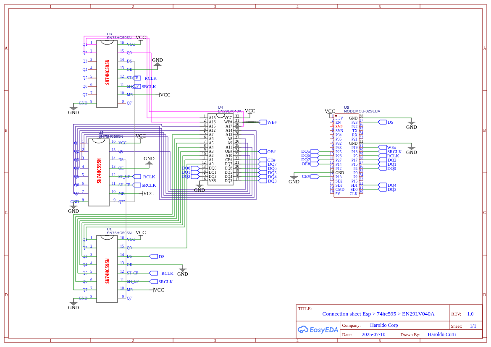

# Interfacing the EN29LV040A
Setting an interface to read/write to an EN29LV040A 4-Megabit flash memory chip

## Background Story

Recently, I've been lurking through my component leftovers(wife insist it's trash) and found this guy all by his own. Thought to myself: "Hey, why not take a look and see what's inside?"

## The main subject: EN29LV040A

The EN29LV040A is a 4-Megabit (512K x 8-bit) electrically erasable, read/write non-volatile flash memory. 
It operates primarily at 3.0V for both read and write operations, with a full voltage range of 2.7V to 3.6V suitable for battery-powered applications and/or a regulated range of 3.0V to 3.6V for high-performance 3.3V microprocessors, which is our case in this project. 
Address pins go from A0-A18, Data pins from Q0-Q7. We are presented also an Output Enable (OE#), Chip Enable (CE#) and Write Enable (WE#) pins for controlling (no Buses here).

## The Plan
Got myself some ESP32S MCUs around and with some patience and time, read what's inside of it. Writing to it would be a bonus (I'm aiming at it).
For ports I'll be using 3 shift registers (sn74hc595) and a bunch of wires. I have the schematics available for future reference.
Here is a fair and modest schematic. Didn't add the debug leds.

